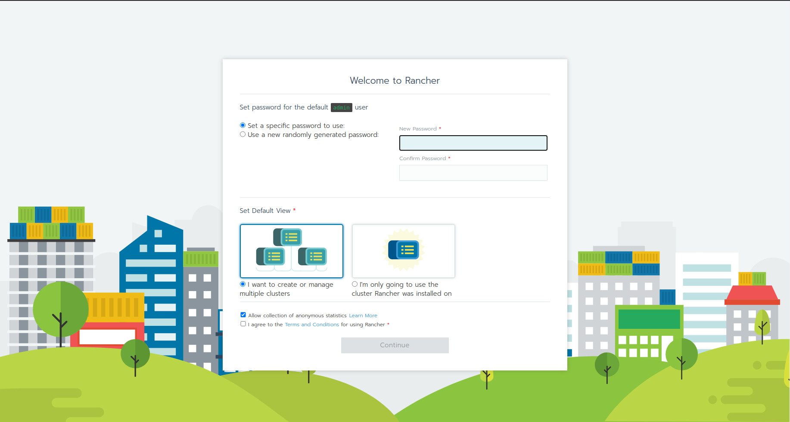

# Local Setup of Rancher with RKE
This repository contains the source code for a local Kubernetes cluster setup using Vagrant and Rancher Kubernetes Engine (RKE). It also outlines the steps to install Rancher.


## Requirements/Prerequisites
- [Rancher Kubernetes Engine (RKE)](https://rancher.com/docs/rke/latest/en/installation/)
- [Virtual Box](https://www.virtualbox.org/wiki/Downloads)
- [Vagrant](https://www.vagrantup.com/docs/installation)

## Create Virtual Machines (VMs)
To spin up the virtual machines, run the following command at the root level of the project directory:
```
vagrant up
```
Once the VMs are up and running, you can check their status with `vagrant status` or by connecting to anyone of them using `vagrant ssh [hostname]`. Once you've confirmed that all machines are running with no issues, copy over the generated SSH keys from your workstation/host to each guest machine with the following commands:
```
ssh-copy-id root@[relevant ip address]
```
When prompted, enter the root user password configured in the bootstrap node script.

## Provision/Create Kubernetes cluster with RKE
To provision the cluster on the VMs, run the `rke config` command. You will be presented with a series of questions to which the answers will be used to declare the cluster config in a generated `cluster.yml` file upon completion. Alternatively, you can create the cluster.yml file and populate it with your desired configuration. Once you have the `cluster.yml` file, run the following command:
```
rke up
```
When the cluster has been provisioned, the following files will be generated in the root directory:
- cluster.rkestate - the cluster state file 
- kube_config_cluster.yml - kube config file

To add the cluster to your context, copy the kube config file:
```
cp kube_config_cluster.yml ~/.kube/config
```
If you do not have a `./kube` directory on your machine you will have to create one. 

The last step will be to check that you can connect to your cluster:
```
kubectl cluster-info
```
or
```
kubectl config current-context
```
If you have a tool like [K9s](https://k9scli.io/), you can start it up to see the objects that are currently running in your cluster. 

## Install Rancher on RKE Cluster
The steps below outline how to install Rancher on your RKE cluster.

### Install Cert Manager
Rancher relies on cert-manager to issue certificates from Rancher's own generated CA or to request Let's Encrypt certificates.
```
kubectl apply -f https://github.com/jetstack/cert-manager/releases/download/v1.4.0/cert-manager.yaml
```

### Create `cattle-system` namespace
Create the namespace where the Rancher application resources will be deployed.
```
kubectl create namespace cattle-system
```

### Add the Helm Chart Repository
```
helm repo add rancher-stable https://releases.rancher.com/server-charts/stable
```

### Install Rancher using Helm
```
helm install rancher rancher-stable/rancher \
  --namespace cattle-system \
  --set hostname=<hostname>
  --set letsEncrypt.email=<email>
```

You may need to update the hosts on your local machine to resolve to the addresses of the Virtual Machines. To do this, go to `/etc/hosts` and add an entry for your hostname like this:
```
172.16.129.21   <hostname>
172.16.129.22   <hostname>
172.16.129.23   <hostname>
```

Lastly, go to your web browser and enter your selected hostname and you should see the following landing page.


